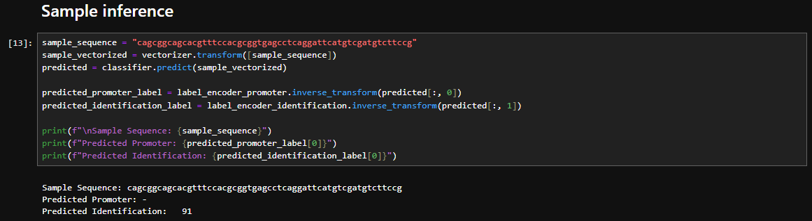

# DNA Sequence Classification

DNA sequence classification AI is based on the dataset from the archive of [UC Irvine Machine Learning Repository](https://archive.ics.uci.edu/ml/machine-learning-databases/molecular-biology/promoter-gene-sequences/promoters.data). It takes an input DNA sequence and outputs the promoter type (+ or -) and the identification class from the inference. The model is using the Random Forest Classification algorithm.

    
    <i>Simple Inference Demo</i>

